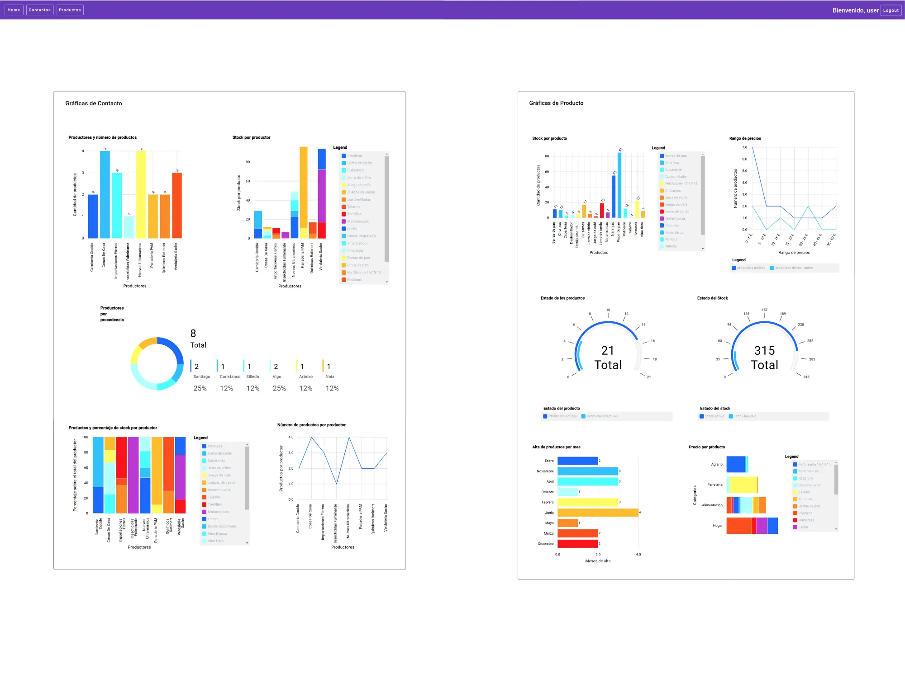

# Amazing Store: Aplicación Web Full-Stack para Gestión de Tiendas/Almacenes



[](https://amazing-store-front-javascript-angular-full.vercel.app)

[](https://amazing-store-front-javascript-angular-full.vercel.app/)

[](https://opensource.org/licenses/MIT)

## Descripción General

Amazing Store es una aplicación web completa diseñada para la gestión eficiente de productos y proveedores en un entorno de tienda o almacén. Este proyecto nació como parte del Bootcamp Full stack del Campus Dual del Cluster Tic Galicia y ha sido significativamente mejorado y ampliado posteriormente, demostrando una iniciativa de aprendizaje continuo.

La aplicación implementa una arquitectura full-stack, combinando un backend robusto desarrollado en Java con Spring Boot, un frontend interactivo creado con Angular y TypeScript, y una base de datos PostgreSQL para la persistencia de datos. Sirve como una demostración práctica de habilidades en tecnologías y prácticas modernas de desarrollo web, incluyendo la gestión de datos relacionales, la creación de APIs RESTful, la implementación de interfaces de usuario dinámicas, la autenticación segura y el despliegue en la nube.

## 🚀 Demo en Vivo

Puedes experimentar la aplicación en funcionamiento aquí:

- **URL**: https://juanfuente.ovh/amazing_store
- **Credenciales de Acceso**:
  - Usuario: `user`
  - Contraseña: `user123`
- **Nota:** El despliegue utiliza los planes gratuitos de Vercel y Railway. El backend puede experimentar un **arranque en frío** (cold start) si no ha recibido tráfico recientemente, tardando 1-2 minutos en la primera respuesta. ¡Es necesario un poco de paciencia!*

*(Nota Importante: El backend está alojado en la capa gratuita de Render.com. Puede tardar aproximadamente 1 minuto en iniciarse ("despertar") durante el primer acceso o después de un período de inactividad. Por favor, ten paciencia al iniciar sesión por primera vez.)*

## Características Principales

Amazing Store ofrece un conjunto de funcionalidades diseñadas para una gestión integral:

- **Gestión Completa de Productos**: Permite realizar operaciones CRUD (Crear, Leer, Actualizar, Borrar) sobre los productos del inventario.
- **Gestión Detallada de Proveedores/Contactos**: Ofrece funcionalidades CRUD completas para gestionar la información de los proveedores o contactos comerciales.
- **Relaciones Lógicas de Datos**: Implementa una vinculación esencial entre productos y sus respectivos productores/proveedores. Un aspecto clave es que para dar de alta un producto, es necesario que tanto su id de productor como su tipo de producto coincidan con los de un productor existente en la base de datos. Esta restricción simula condiciones reales de gestión de inventario, asegurando la integridad de los datos y las relaciones comerciales.
- **Visualización de Datos Perspicaz**: Cuenta con 11 elementos gráficos distintos que representan puntos de datos clave para una toma de decisiones informada. Por ejemplo, la aplicación muestra visualmente la cantidad de productos activos frente a inactivos y la distribución de productos por cada proveedor. Estas visualizaciones ofrecen una visión rápida y útil del estado del inventario y las relaciones con los proveedores.
- **Autenticación Segura de Usuarios**: Incorpora un sistema de inicio de sesión basado en JSON Web Tokens (JWT). Esto garantiza que solo los usuarios autorizados puedan acceder y manipular los datos de la aplicación, añadiendo una capa fundamental de seguridad.

## Pila Tecnológica

La aplicación se ha construido utilizando un conjunto de tecnologías modernas y ampliamente adoptadas en la industria:

| Categoría       | Tecnología         | Detalles                                           |
|-----------------|--------------------|----------------------------------------------------|
| Frontend        | Angular/CLI 15.2.9 | Framework para construir interfaces de usuario     |
|                 | TypeScript 4.9.4   | Superset de JavaScript para tipado estático        |
|                 | HTML               | Lenguaje de marcado estándar                       |
|                 | CSS                | Lenguaje de estilos                                |
| Backend         | Java 17            | Versión LTS con soporte a características modernas |
|                 | Spring Boot 3.2.4  | Framework principal con autoconfiguración          |
|                 | Maven              | Gestión de dependencias y construcción             |
|                 | JWT                | Autenticación segura con tokens                    |
|                 | Hibernate          | ORM para persistencia en PostgreSQL                |
|                 | Lombok             | Reducción de código boilerplate                    |
| Base de Datos   | PostgreSQL         | Sistema de gestión de bases de datos relacional    |
|                 | Supabase           | Plataforma BaaS (utilizada para alojar PostgreSQL) |
| Despliegue      | Docker             | Plataforma de contenerización                      |
|                 | Render.com         | Plataforma PaaS (utilizada para alojar el backend) |

## Arquitectura y Flujo de Trabajo (Alto Nivel)

La aplicación sigue una arquitectura cliente-servidor bien definida:

1. **Cliente-Servidor**: El frontend, desarrollado en Angular, actúa como el cliente que interactúa con el usuario. El backend, una API RESTful construida con Spring Boot, maneja la lógica de negocio y el acceso a datos.
2. **Autenticación de Usuarios**:
   - El usuario introduce sus credenciales (`user`/`user123`) en la interfaz de Angular.
   - El frontend envía estas credenciales al endpoint de login del backend Spring Boot.
   - El backend verifica las credenciales contra la tabla `users` en la base de datos PostgreSQL.
   - Si las credenciales son válidas, el backend genera un JSON Web Token (JWT) y lo devuelve al frontend.
   - El frontend almacena este JWT (generalmente en `localStorage` o `sessionStorage`).
   - Para las solicitudes posteriores a endpoints protegidos, el frontend incluye el JWT en la cabecera `Authorization` (normalmente como `Bearer <token>`).
   - El backend valida el JWT en cada solicitud protegida antes de procesarla.
3. **Flujo de Gestión de Datos (Ejemplo: Añadir Producto)**:
   - El usuario rellena el formulario para añadir un nuevo producto en la interfaz de Angular.
   - El frontend envía una solicitud HTTP (normalmente POST) al endpoint correspondiente de la API Spring Boot, incluyendo los datos del producto.
   - El backend recibe la solicitud. Antes de interactuar con la base de datos, valida los datos de entrada. Crucialmente, verifica que el `id` de productor y el tipo de producto proporcionados coincidan con un registro existente en la tabla de contactos/productores. Esta lógica de negocio asegura la integridad referencial.
   - Si la validación es exitosa, el backend utiliza su capa de persistencia (probablemente JPA/Hibernate) para interactuar con la base de datos PostgreSQL y guardar el nuevo producto.
   - La base de datos confirma la operación.
   - El backend devuelve una respuesta al frontend (por ejemplo, confirmando la creación y devolviendo el nuevo producto con su ID).
   - El frontend recibe la respuesta y actualiza la interfaz de usuario para reflejar el cambio (por ejemplo, añadiendo el nuevo producto a la lista visible).

## Primeros Pasos (Desarrollo Local)

### Prerrequisitos:

- Git
- Node.js y npm (o yarn) - Versión LTS recomendada
- Java JDK (Versión compatible con el proyecto Spring Boot, por ejemplo, 11, 17 o superior)
- Maven o Gradle (Según lo utilizado en el proyecto backend)
- Docker (Opcional, pero útil si se proporcionan Dockerfiles para desarrollo local)
- Un cliente SQL para PostgreSQL (opcional, para inspeccionar la base de datos)

#### Variables de Entorno (Backend)

Crear archivo `.env` en raíz del proyecto backend con:
```properties
SPRING_DATASOURCE_URL=jdbc:postgresql://[HOST]:[PORT]/[DB_NAME]
SPRING_DATASOURCE_USERNAME=[USER]
SPRING_DATASOURCE_PASSWORD=[PASSWORD]
JWT_SECRET=TuClaveSecretaParaFirmarJWT
```


#### Clonación del Repositorio


```bash
Frontend (Asegúrate que la URL es correcta)

git clone https://github.com/Juan-Fuente-T/amazing_store-front-javascript-angular
Backend

git clone https://github.com/Juan-Fuente-T/amazing_store_backend_java
```
#### Configuración del Backend (Spring Boot)

```bash
Navega al directorio del backend:
cd amazing_store_backend_java
```

Configura las variables de entorno: Edita o crea un archivo .env en la raíz del backend (o configúralas en tu entorno/IDE) con las variables necesarias (ver sección de Base de Datos).

#### Compilación y ejecución:
```bash
Compilar con Maven (recomendado)

./mvnw clean install -DskipTests
Ejecutar con perfil de desarrollo (si usas perfiles)

./mvnw spring-boot:run -Dspring-boot.run.profiles=dev

O simplemente ejecutar el JAR si ya compilaste:
java -jar target/nombre-del-jar-backend.jar

```
La API estará disponible en: http://localhost:8080
Configuración del Frontend (Angular)

Navega al directorio del frontend:
```bash
cd amazing_store-front-javascript-angular
```

#### Instalar dependencias:
```bash
npm install
```

#### Configurar entorno: 
Revisa/edita el archivo src/environments/environment.ts (o environment.prod.ts para producción) para asegurarte de que apiUrl apunta a tu backend:
```typescript
// Ejemplo para desarrollo local (src/environments/environment.ts)

export const environment = {
production: false,
apiUrl: 'http://localhost:8080' 
};
```

#### Iniciar servidor de desarrollo:
```bash
ng serve -o
```
La aplicación estará disponible en: http://localhost:4200

#### 🐳 Ejecución con Docker (Opcional)

(Asegúrate de tener un Dockerfile en el backend y/o un docker-compose.yml configurado)

Construir imagen del backend (ejemplo): 

```bash
Estando dentro de la carpeta del backend

docker build -t amazing-store-backend .
```

#### Ejecutar contenedor (ejemplo): 
```bash

Asegúrate de pasar las variables de entorno necesarias

docker run -p 8080:8080 --env-file .env amazing-store-backend
```

#### 📊 Configuración de Base de Datos (Local)

La aplicación utiliza PostgreSQL. Para desarrollo local:

Instala PostgreSQL si no lo tienes.
Crea una base de datos (ej: amazing_store) y un usuario/rol para la aplicación.
Actualiza las variables de entorno o el archivo src/main/resources/application-dev.properties (si usas perfiles) con tus datos de conexión locales: 
```properties 
SPRING_DATASOURCE_URL=jdbc:postgresql://localhost:5432/amazing_store SPRING_DATASOURCE_USERNAME=tu_usuario_postgres 
SPRING_DATASOURCE_PASSWORD=tu_contraseña_postgres
```
Asegúrate también de tener JWT_SECRET, etc.

## 🚀 Trayectoria de Desarrollo: Retos y Aprendizajes

Durante el desarrollo de este proyecto, me enfrenté a varios desafíos técnicos significativos, cuya resolución contribuyó enormemente a mi aprendizaje:
#### Migración de Base de Datos (HSQLDB a PostgreSQL)

* **Reto:** La aplicación utilizaba inicialmente HSQLDB, una base de datos en memoria adecuada para desarrollo pero que limitaba severamente la escalabilidad, la persistencia real y la accesibilidad de los datos fuera del entorno local.
* **Acción:** Se tomó la decisión estratégica de migrar la base de datos a PostgreSQL, alojándola en Supabase para el despliegue. Esto implicó no solo cambiar la tecnología de base de datos sino también aprender a gestionar una instancia en la nube.
* **Aprendizaje:** Este proceso proporcionó una valiosa experiencia en la configuración de conexiones remotas seguras a bases de datos, la adaptación y optimización de consultas SQL para PostgreSQL, y la comprensión de las ventajas significativas de utilizar un sistema de gestión de bases de datos robusto y alojado en la nube para aplicaciones destinadas a ser accesibles y escalables. Pasar de HSQLDB a PostgreSQL refleja una madurez en la comprensión de arquitecturas de software orientadas a producción.

#### Mejora de las Relaciones de Datos (Conexión Producto-Productor)

* **Reto:** El modelo de datos inicial carecía de una conexión explícita y forzada entre los productos y sus proveedores (contactos/productores), una omisión significativa para una aplicación de gestión de inventario realista.
* **Acción:** Se rediseñó el esquema de la base de datos para incluir relaciones claras (claves foráneas) entre las tablas de productos y contactos/productores. Esto requirió la creación de nuevos endpoints en la API de Spring Boot para manejar estas relaciones y la actualización correspondiente de los componentes y servicios del frontend en Angular para permitir a los usuarios gestionar y visualizar esta conexión. Se implementó la lógica de negocio clave que requiere la coincidencia de ID de productor y tipo de producto al crear un producto.
* **Aprendizaje:** Esta mejora profundizó la comprensión del diseño de bases de datos relacionales, el desarrollo de APIs RESTful (creación de endpoints, manejo de DTOs, validaciones) y la integración full-stack del flujo de datos. Fue un ejercicio práctico en traducir requisitos de negocio del mundo real en una implementación técnica coherente, demostrando capacidad para modelar y construir sistemas más complejos.

#### Ampliación de la Visualización de Datos

* **Reto:** Las visualizaciones iniciales se centraban exclusivamente en el stock de productos, ofreciendo una visión limitada. Faltaban insights sobre la base de proveedores/contactos.
* **Acción:** Se desarrolló un nuevo conjunto de gráficos (usando Chart.js o similar en Angular) específicamente dedicados a mostrar información relevante sobre los contactos/productores, equilibrando el panel de control y proporcionando una visión más holística.
* **Aprendizaje:** Esta tarea permitió ganar soltura con librerías de gráficos en Angular, aprendiendo a seleccionar los tipos de gráficos adecuados y a integrarlos eficientemente. Subraya la importancia de la visualización como herramienta fundamental para convertir datos brutos en información accionable para el usuario final.

#### Contenerización y Despliegue en la Nube (Docker & Render)

* **Reto:** Era necesario un método fiable y reproducible para desplegar el backend y hacerlo accesible públicamente.
* **Acción:** Se contenerizó la aplicación backend de Spring Boot utilizando Docker (creando un Dockerfile). Esta imagen Docker fue luego desplegada en la plataforma PaaS Render.com, configurando las variables de entorno necesarias.
* **Aprendizaje:** Este paso implicó dominar los fundamentos de Docker y aprender estrategias de despliegue en plataformas Cloud PaaS. Esto incluyó la configuración de variables de entorno remotas, la gestión del ciclo de vida de aplicaciones contenerizadas y la depuración de problemas específicos del entorno de despliegue, demostrando competencia en prácticas DevOps modernas.

#### Implementación de Seguridad (Autenticación JWT)

* **Reto:** La aplicación carecía inicialmente de control de acceso.
* **Acción:** Se implementó un sistema de inicio de sesión seguro utilizando JSON Web Tokens (JWT) con Spring Security. Se añadió una tabla users a la base de datos, se configuró BCryptPasswordEncoder para el hashing de contraseñas, se creó un UserDetailsService personalizado, se implementó un filtro JWT (JwtTokenFilter) y se protegieron los endpoints de la API mediante configuración de seguridad y anotaciones (@PreAuthorize). El frontend Angular se adaptó para manejar el flujo de login/registro y el almacenamiento/envío del token JWT.
* **Aprendizaje:** Proporcionó experiencia práctica invaluable con conceptos de autenticación y autorización stateless, patrones JWT, hashing seguro de contraseñas, integración de gestión de usuarios con la BD y securización de APIs REST, demostrando comprensión de principios de seguridad esenciales.

### 🤝 Contribuciones

Las contribuciones son bienvenidas. Por favor, sigue los pasos estándar de fork y pull request.

### 📜 Licencia

Distribuido bajo la   **Licencia MIT.** Ver LICENSE para más
